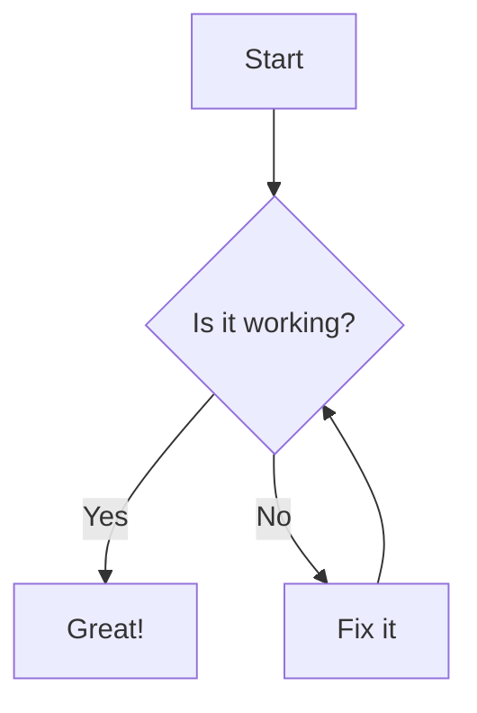

# Markdown Feature Test

## 1. Headings

# H1 Heading  
## H2 Heading  
### H3 Heading  
#### H4 Heading  
##### H5 Heading  
###### H6 Heading  

---

## 2. Emphasis

- *Italic text*
- _Italic text_
- **Bold text**
- __Bold text__
- ~~Strikethrough~~

---

## 3. Lists

### Unordered List

- Item 1  
  - Subitem 1.1  
    - Subitem 1.1.1  
      - Subitem 1.1.1.1  
        - Subitem 1.1.1.1.1  
          - Subitem 1.1.1.1.1.1

### Ordered List

1. First
2. Second  
   1. Sub-second  
      1. Sub-sub-second

---

## 4. Links

- [Inline link](https://example.com)
- [Reference-style link][example]

[example]: https://example.com

---

## 5. Images


---

## 6. Code

### Inline Code

Here is some `inline code`.

### Code Block

````javascript
function greet(name) {
    console.log(`Hello, ${name}!`);
}
`````

---

## 7. Blockquotes

> This is a blockquote.
>
> > Nested blockquote.

---

## 8. Tables

| Syntax | Description |
| ------ | ----------- |
| Header | Title       |
| Cell   | Text        |

---

## 9. Horizontal Rules

---

---

---

---

## 10. Task Lists

* [x] Task completed
* [ ] Task not completed

---

## 11. HTML Elements

<p style="color: red;">This is a paragraph with inline HTML styling.</p>

---

## 12. Escaping Characters

\*Literal asterisks\*

---

## 13. Mermaid Diagram



---

## 14. Footnotes (NOT CURRENTLY SUPPORTED)

Here is a footnote reference[^1].

[^1]: This is the footnote.

---

## 15. Definition Lists (NOT CURRENTLY SUPPORTED)

Term 1
: Definition 1

Term 2
: Definition 2a
: Definition 2b

---

## 16. Emoji (if supported)

😄 \:tada: :+1:

---

## 17. Math (NOT CURRENTLY SUPPORTED via KaTeX or MathJax)

Inline math: \$E = mc^2\$
Block math:

```math
\int_{a}^{b} x^2 dx